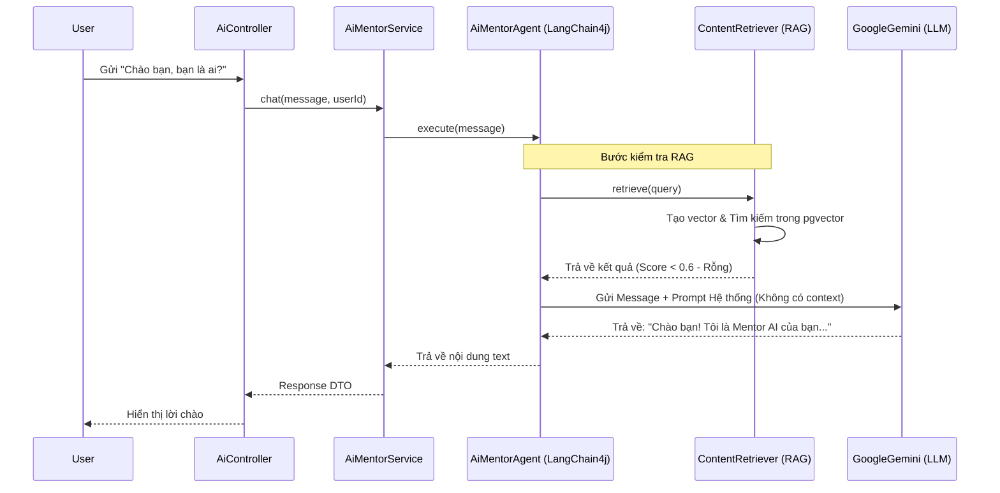
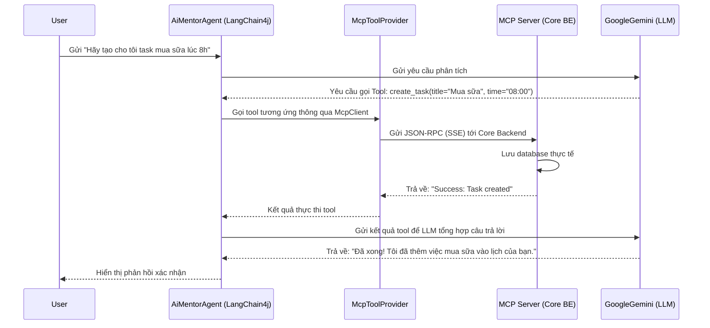
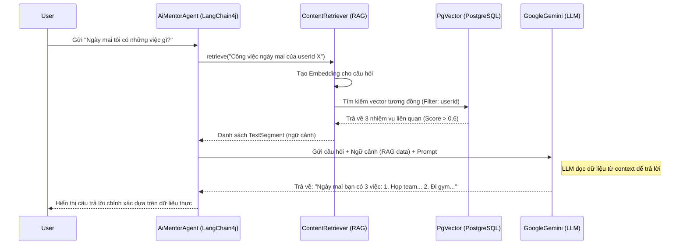

# AI Workflow Sequence Diagrams - TimeMaster AI

Dưới đây là sơ đồ tuần tự mô tả cách hệ thống xử lý 3 loại yêu cầu phổ biến dựa trên kiến trúc thực tế của module `timemaster-ai`.

---

## 1. Câu lệnh Chào hỏi Thông thường
*LLM sẽ trả lời dựa trên Persona mà không cần dữ liệu bổ sung.*

---

## 2. Câu lệnh Yêu cầu dùng Tool (MCP)
*Hệ thống nhận diện ý định thực hiện hành động và gọi đến server Core thông qua giao thức MCP.*

---

## 3. Câu lệnh RAG (Truy vấn dữ liệu cá nhân)
*Tìm kiếm ngữ cảnh từ pgvector trước khi gửi đến LLM.*

---

## Giải thích các thành phần chính:
1.  **ContentRetriever (RAG):** Được cấu hình với `minScore(0.6)`. Nếu câu lệnh là chào hỏi, độ tương đồng thấp nên nó sẽ không lấy dữ liệu rác vào context, giúp tiết kiệm token và tránh làm loãng câu trả lời.
2.  **McpToolProvider:** Kết nối với Core Backend qua SSE. Đây là cầu nối giúp AI không chỉ "nói" mà còn "làm" được (tạo task, sửa habit).
3.  **UserContext:** Đảm bảo RAG và Tool chỉ truy cập dữ liệu của chính người dùng đang đăng nhập thông qua Filter `userId`.
