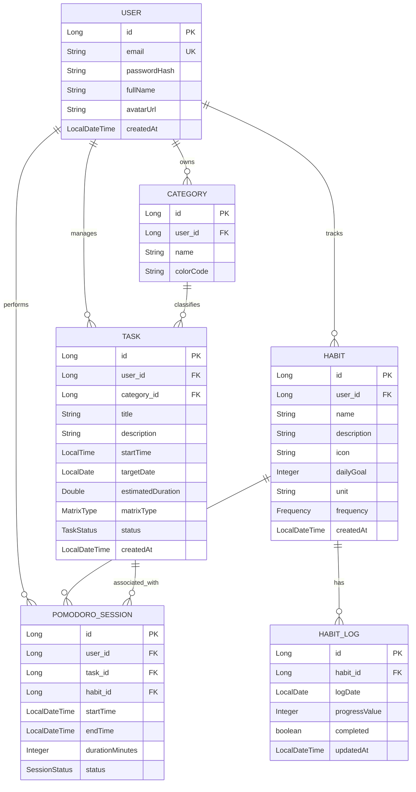

# Entity Relationship Model - TimeMaster AI

Tài liệu này mô tả chi tiết các thực thể (Entities), thuộc tính (Attributes) và mối quan hệ (Relationships) trong hệ thống Backend của TimeMaster.

## 1. Sơ đồ quan hệ (ER Diagram)

---

## 2. Chi tiết các thực thể

### 2.1. User (Người dùng)
Lưu trữ thông tin định danh và tài khoản.

| Thuộc tính | Kiểu dữ liệu | Mô tả | Ràng buộc |
| :--- | :--- | :--- | :--- |
| `id` | Long | Khóa chính | PK, Auto Increment |
| `email` | String | Địa chỉ email | Unique, Not Null |
| `passwordHash` | String | Mật khẩu băm | Not Null |
| `fullName` | String | Tên đầy đủ | Not Null |
| `avatarUrl` | String | Ảnh đại diện | |
| `createdAt` | LocalDateTime | Ngày tạo | Default: Now |

### 2.2. Category (Danh mục)
Phân loại nhiệm vụ (VD: Công việc, Cá nhân, Học tập).

| Thuộc tính | Kiểu dữ liệu | Mô tả | Ràng buộc |
| :--- | :--- | :--- | :--- |
| `id` | Long | Khóa chính | PK |
| `user` | User | Chủ sở hữu | FK, Not Null |
| `name` | String | Tên danh mục | Not Null |
| `colorCode` | String | Mã màu UI | Hex code |

### 2.3. Task (Nhiệm vụ)
Các đầu việc cụ thể trong Ma trận Eisenhower.

| Thuộc tính | Kiểu dữ liệu | Mô tả | Ràng buộc |
| :--- | :--- | :--- | :--- |
| `id` | Long | Khóa chính | PK |
| `user` | User | Người thực hiện | FK, Not Null |
| `category` | Category | Phân loại | FK, Optional |
| `title` | String | Tiêu đề | Not Null |
| `matrixType` | Enum | Q1, Q2, Q3, Q4 | Not Null |
| `status` | Enum | Trạng thái | PENDING, IN_PROGRESS, COMPLETED |

### 2.4. Habit (Thói quen)
Theo dõi các hành vi lặp lại.

| Thuộc tính | Kiểu dữ liệu | Mô tả | Ràng buộc |
| :--- | :--- | :--- | :--- |
| `id` | Long | Khóa chính | PK |
| `dailyGoal` | Integer | Mục tiêu số lượng | Default: 1 |
| `frequency` | Enum | Tần suất | DAILY, WEEKLY |
| `unit` | String | Đơn vị tính | VD: "lít", "trang" |

### 2.5. HabitLog (Nhật ký thói quen)
Ghi nhận tiến độ thói quen hàng ngày.

| Thuộc tính | Kiểu dữ liệu | Mô tả | Ràng buộc |
| :--- | :--- | :--- | :--- |
| `id` | Long | Khóa chính | PK |
| `habit` | Habit | Tham chiếu thói quen | FK, Not Null |
| `logDate` | LocalDate | Ngày ghi nhận | Unique với habit_id |
| `progressValue`| Integer | Tiến độ đạt được | Default: 0 |

### 2.6. PomodoroSession (Phiên tập trung)
Dữ liệu từ đồng hồ Pomodoro.

| Thuộc tính | Kiểu dữ liệu | Mô tả | Ràng buộc |
| :--- | :--- | :--- | :--- |
| `id` | Long | Khóa chính | PK |
| `task`/`habit` | Task/Habit | Mục tiêu tập trung | FK, Optional |
| `status` | Enum | Kết quả phiên | COMPLETED, INTERRUPTED |

---

## 3. Quy tắc nghiệp vụ (Business Rules)
1. **Liên kết tập trung**: Một phiên Pomodoro có thể không gắn với Task nào (tập trung tự do) hoặc gắn với 1 Task/Habit cụ thể.
2. **Ma trận Eisenhower**: Mỗi Task bắt buộc phải thuộc một trong 4 nhóm:
   - **Q1**: Quan trọng & Khẩn cấp.
   - **Q2**: Quan trọng nhưng Không khẩn cấp.
   - **Q3**: Không quan trọng nhưng Khẩn cấp.
   - **Q4**: Không quan trọng & Không khẩn cấp.
3. **Tính duy nhất**: Một thói quen chỉ có tối đa 1 bản ghi nhật ký trong một ngày.
