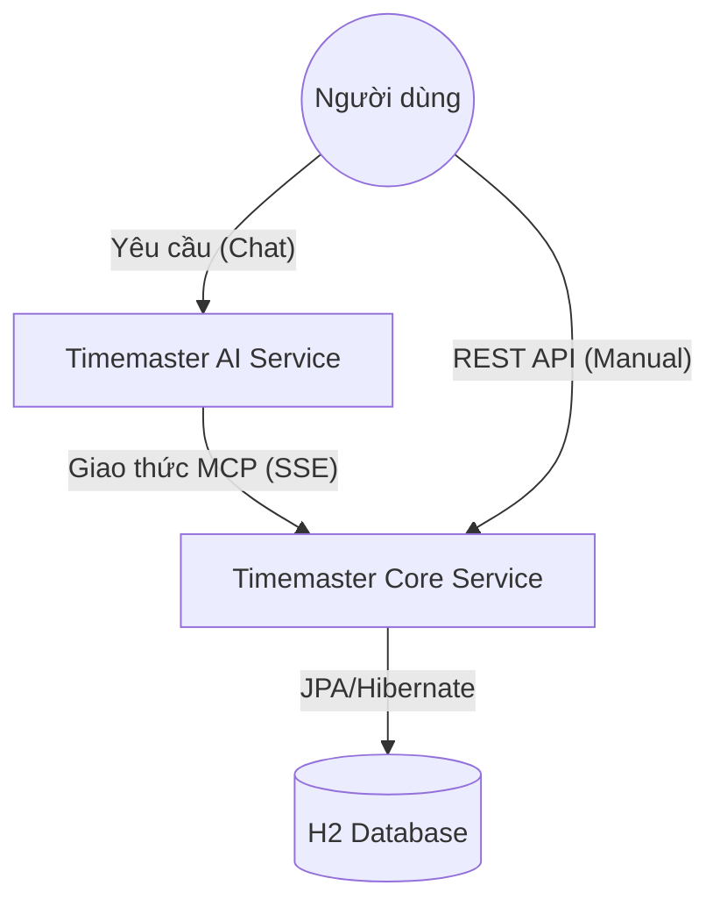
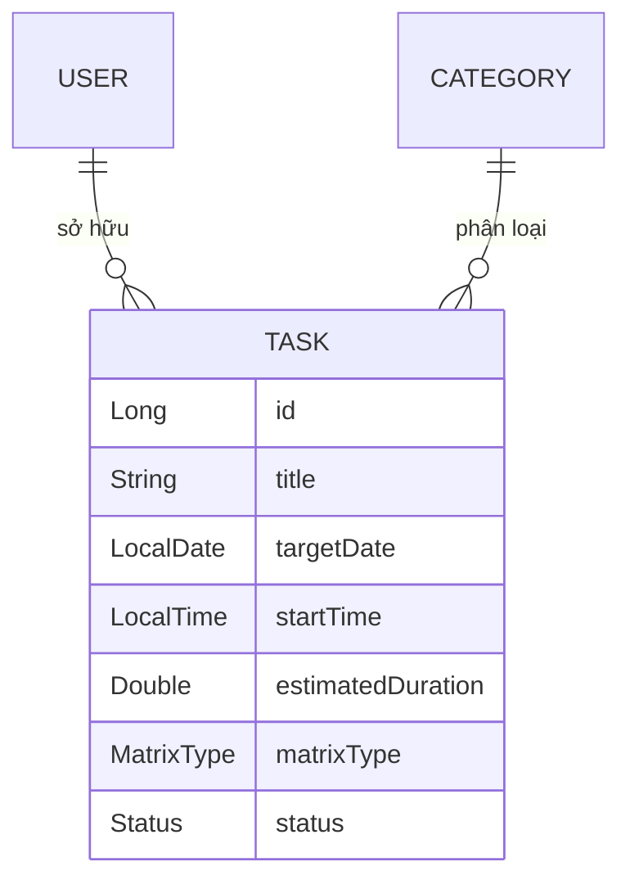

# Tài liệu kiến trúc hệ thống TimeMaster

Hệ thống TimeMaster được xây dựng theo kiến trúc Microservices, bao gồm hai dịch vụ chính: **Timemaster Core** (Quản lý dữ liệu và nghiệp vụ) và **Timemaster AI** (Trợ lý điều phối thông minh).

---

## 1. Bản đồ kiến trúc tổng quát

---

## 2. Dịch vụ chi tiết

### A. Timemaster Core (`timemaster`)
Là trái tim của hệ thống, chịu trách nhiệm lưu trữ và xử lý toàn bộ logic nghiệp vụ.

#### 📂 Cấu trúc dữ liệu (Entities)
- **User**: Thông tin người dùng.
- **Task**: Công việc cần thực hiện (Tiêu đề, Ngày, Giờ bắt đầu, Thời lượng, Mức độ ưu tiên Q1-Q4).
- **Category**: Danh mục công việc (Học tập, Việc làm, Cá nhân...).

#### ⚙️ Các phương thức chính (Service Layer)
- `createTask(userId, request)`: Kiểm tra ngày quá khứ, kiểm tra trùng lịch (Conflict), lưu task mới.
- `updateTask(taskId, userId, request)`: Cập nhật thông tin công việc, hỗ trợ cờ `force` để ghi đè.
- `completeTask(taskId, userId)`: Đánh dấu hoàn thành.
- `deleteTask(taskId, userId)`: Xóa công việc.
- `validateTimeOverlap(...)`: Logic tính toán va chạm thời gian và tính "thời gian còn lại" của các việc đang diễn ra.

#### 🛠️ Giao diện MCP Tools (Dành cho AI)
Hệ thống cung cấp các công cụ sau cho AI thông qua MCP:
- `mcpCreateTask`: Tạo task mới (Hỗ trợ `force`).
- `mcpGetTasks`: Liệt kê danh sách task.
- `mcpUpdateTask`: Sửa task.
- `mcpCompleteTask`: Hoàn thành task.
- `mcpDeleteTask`: Xóa task.

---

### B. Timemaster AI (`timemaster-ai`)
Là bộ não điều phối, giao tiếp với người dùng và ra lệnh cho Core Service.

#### 🧠 Thành phần AI
- **Model**: Gemini (thông qua LangChain4j).
- **Prompt System**: Được thiết kế để AI hành động quyết đoán, tự điền thông tin thiếu và biết đàm phán khi có trùng lịch.
- **MCP Client**: Kết nối đến endpoint SSE của Core Service để thực thi tool.

---

## 3. Mối quan hệ thực thể (ER Diagram)

---

## 4. Luồng xử lý trùng lịch (Conflict Logic)

Đây là tính năng thông minh nhất của hệ thống:

1. **BE Check**: Khi có yêu cầu tạo/sửa, Core sẽ quét các task trong ngày.
2. **Overlap Formula**: `(Bắt đầu mới < Kết thúc cũ) AND (Bắt đầu cũ < Kết thúc mới)`.
3. **Smart Warning**:
   - Nếu việc cũ đã bắt đầu: Tính `Phút còn lại = Tổng thời lượng - (Giờ mới - Giờ cũ)`.
   - Nếu việc cũ chưa bắt đầu: Hiển thị giờ bắt đầu của việc cũ.
4. **Negotiation**: AI nhận lỗi `409 Conflict`, báo lại cho sếp và hỏi ý kiến. Nếu sếp OK, gọi lại tool với `force=true`.

---

## 5. Danh sách các API Endpoint (REST)

| Phương thức | Endpoint | Mô tả |
| :--- | :--- | :--- |
| **POST** | `/api/ai/chat` | Chat với AI Mentor |
| **GET** | `/api/tasks` | Lấy danh sách task (Manual) |
| **POST** | `/api/tasks` | Tạo task mới (Manual) |
| **GET** | `/api/ai/testTools` | Kiểm tra các Tools AI đang có |

---
*Tài liệu này được cập nhật tự động bởi Antigravity AI.*
